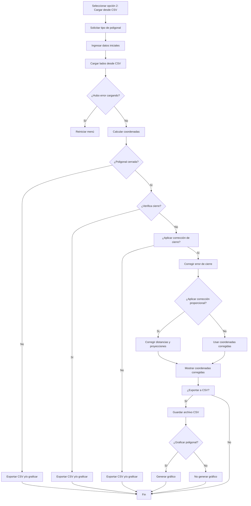

# PROYECTO-FINAL
## TopograficTool-Herramienta para cálculos topograficos en Ingenieria Civil
## Autores
- Maria Camila Palomo Avila
- Santiago Ramos Barriga
  
Curso: Programación de Computadores    
Grupo: 404 CNF (Chill Not Found)    
Universidad Nacional de Colombia  

## Problema
Durante el desarrollo del curso de Geomática Básica en Ingeniería Civil, enfrentamos múltiples retos al momento de procesar los datos topográficos obtenidos en campo. Una de las principales dificultades fue la corrección manual de errores en poligonales abiertas y cerradas, especialmente cuando los ángulos no cuadraban con los valores teóricos esperados o cuando se presentaban errores de cierre. Este proceso no solo era propenso a errores humanos, sino que también consumía tiempo valioso.

### ¿Por qué este problema?
Escogimos este problema porque lo vivimos de primera mano durante nuestras prácticas académicas. Sentimos la necesidad de contar con una herramienta que no solo automatizara el cálculo de coordenadas, sino que también permitiera realizar correcciones angulares y de cierre de manera precisa y rápida. Creemos que esta herramienta puede ser útil para otros estudiantes que necesiten validar sus datos topográficos de forma sencilla y confiable.

## Solución propuesta
Desarrollamos TopograficTool, una aplicación interactiva en Python que permite:

- Ingresar datos de ángulos y distancias manualmente o mediante archivos .csv. 
- Identificar si la poligonal es abierta o cerrada.
- Calcular automáticamente la suma teórica de los ángulos.
- Aplicar correcciones angulares cuando sea necesario.
- Realizar el cálculo de coordenadas a partir del azimut inicial y los datos corregidos.
- Graficar la poligonal con nombres, distancias y coordenadas.
- Exportar los resultados a archivos .csv y la gráfica a formato .png.
  
## Contextualización
Una poligonal es una secuencia de líneas rectas conectadas entre sí mediante ángulos, comúnmente utilizadas en levantamientos topográficos para determinar posiciones sobre el terreno. Estas figuras permiten representar caminos, límites de terrenos, perímetros o recorridos, dependiendo de la aplicación.

Existen dos tipos principales:

- Poligonal cerrada: parte de un punto conocido y regresa a ese mismo punto. Esto permite verificar si hubo errores, ya que se puede comparar la coordenada final calculada con la inicial y aplicar correcciones proporcionales si hay discrepancias.

- Poligonal abierta: no regresa al punto de partida. Aunque es más fácil de ejecutar en campo (como en el caso de una carretera), su análisis es más exigente porque no se puede cerrar el ciclo geométricamente para validar errores de forma directa.

Este contexto es clave para entender por qué los cálculos de ángulos, distancias y coordenadas deben ser tratados cuidadosamente en ambos casos.

## ¿Cómo se abordo el problema?
Para calcular las coordenadas de una poligonal se necesita:

- Las coordenadas de los dos primeros puntos, que establecen la dirección inicial.
- Por cada segmento: la distancia, el ángulo medido, y la dirección (izquierda o derecha).
- El tipo de ángulo usado (interno o externo) y la cantidad total de ángulos.
Con esta información:
- Se calcula el rumbo inicial (dirección del primer segmento).
- Se actualiza el rumbo según los ángulos y las direcciones indicadas.
- A partir del rumbo y la distancia, se determinan las nuevas coordenadas usando funciones trigonométricas.

Si es una poligonal cerrada, se realiza una verificación del cierre geométrico y se aplica una corrección proporcional a las coordenadas para distribuir el error de forma balanceada.

Finalmente, se exportan y grafican los resultados.

# Explicación del código
## 1. Menú
Para facilitar la interacción del usuario con la herramienta, se diseñó un menú principal que se muestra al ejecutar el programa. Este menú permite al usuario elegir entre las diferentes formas de ingreso de datos o salir del programa.
```
ef mostrar_menú(): # Esta función imprime el menú principal para que el usuario pueda interactuar
    print("╔═════════════════════════════════════════════╗")
    print("║        Bienvenido al TopograficTool         ║")
    print("╠═════════════════════════════════════════════╣")
    print("║  1. Ingresar los datos manualmente          ║")
    print("║  2. Cargar los datos desde un archivo(.csv) ║")
    print("║  3. Salir                                   ║")
    print("╚═════════════════════════════════════════════╝")
```
## 2. Opción 1 (Ingresar los datos manualmente)
Cuando el usuario selecciona la opción 1, el programa lo guía paso a paso para ingresar manualmente los datos necesarios para calcular una poligonal, ya sea cerrada o abierta.
El flujo general es el siguiente:
````mermaid
flowchart TD
    A[Inicio - Usuario escoge opción 1] --> B[Seleccionar tipo de poligonal: cerrada o abierta]
    B --> C[Ingresar coordenadas iniciales y azimut]
    C --> D[Ingresar lados y ángulos]
    D --> E[Calcular coordenadas]
    E --> F{Es poligonal cerrada}

    F -- No --> G1[Exportar CSV]
    G1 --> H1[Graficar poligonal]
    H1 --> Z1[Fin]

    F -- Sí --> G[Verificar cierre]
    G --> H{Cierre correcto}

    H -- Sí --> I[Exportar CSV]
    I --> J[Graficar poligonal]
    J --> Z2[Fin]

    H -- No --> K[Aplicar corrección angular]
    K --> L[Corregir distancias y proyecciones]
    L --> M[Aplicar corrección proporcional]
    M --> N[Mostrar coordenadas corregidas]
    N --> O[Exportar CSV]
    O --> P[Graficar poligonal]
    P --> Z3[Fin]
````
### Entrada de datos: 
**1. Solicitar el tipo de poligonal**
```
def solicitar_tipo_poligonal():
    # Solicita al usuario que indique si trabajará con una poligonal abierta o cerrada.
    while True:  # Bucle que se repite hasta que el usuario ingrese una opción válida
        print("¿Qué tipo de poligonal vas a trabajar mi rey/reina?")
        print("1. Abierta")
        print("2. Cerrada")
        tipo = input("Seleccione el tipo (1 o 2): ")
        if tipo == "1":
            return "abierta"  # Retorna "abierta" si elige la opción 1
        elif tipo == "2":
            return "cerrada"  # Retorna "cerrada" si elige la opción 2
        else:
            print("No mi rey/reina, esa es una opción inválida")  # Mensaje de error si la opción es incorrecta
```
**2. Ingreso de datos:**

Esta función guía al usuario en el ingreso de los datos topográficos base para iniciar el cálculo de la poligonal. El procedimiento contempla el ingreso de:
- Coordenadas del punto inicial (X, Y): en metros, pueden ser valores reales (UTM, por ejemplo) o de un sistema local arbitrario.
- Azimut inicial: solicitado en sistema sexagesimal (grados, minutos y segundos), el cual es validado para evitar errores comunes. Luego, se convierte a grados decimales, formato requerido para realizar los cálculos posteriores como la proyección de distancias.

Esta etapa es crucial, ya que define el punto de partida y la dirección inicial del levantamiento topográfico.

**Retorna:**

- x_inicial (float): Coordenada Este (X) del punto de partida.
- y_inicial (float): Coordenada Norte (Y) del punto de partida.
- azimut_decimal (float): Dirección inicial expresada en grados decimales.
```
def ingreso_datos():
    # Mensajes informativos para el usuario
    print("\n>>> Ingreso de coordenadas y azimut inicial")
    print("RECUERDA: Ingresa los ángulos en sistema sexagesimal")
    print("          Ingrese las coordenadas del punto inicial (X, Y) en metros.")
    print("          Puede usar coordenadas reales o un sistema local arbitrario.")
    # Se piden las coordenadas del punto inicial
    x_inicial = float(input("Ingrese la coordenada X del punto inicial: "))
    y_inicial = float(input("Ingrese la coordenada Y del punto inicial: "))
    # Ingreso del azimut inicial
    print("Ingrese el azimut inicial en sistema sexagesimal:")
    # Validación del formato correcto de minutos y segundos
    while True:
        grados = int(input("  Grados: "))
        minutos = int(input("  Minutos: "))
        segundos = float(input("  Segundos: "))
        # Asegura que los minutos y segundos estén en el rango válido
        if 0 <= minutos < 60 and 0 <= segundos < 60:
            break
        else:
            print("Noporolo, otra vez, los minutos y segundos deben estar entre 0 y 59.")
    
    # Conversión del ángulo de sexagesimal a decimal
    azimut_decimal = grados + minutos / 60 + segundos / 3600
    # Muestra el azimut convertido para verificación
    print(f"El azimut inicial en decimal: {azimut_decimal:.3f}°")
    # Devuelve los valores necesarios
    return x_inicial, y_inicial, azimut_decimal
```
**3. Entrada de datos (lados y ángulos)**

Esta función solicita al usuario los datos topográficos de cada lado de la poligonal: la distancia, la dirección de giro (izquierda o derecha) y el ángulo en sistema sexagesimal.
Si se trata de una poligonal cerrada, se consulta además si los ángulos son internos o externos para aplicar una corrección angular automática que garantice el cierre geométrico.
Se asegura que todos los giros tengan la misma dirección para coherencia geométrica.
Cada ángulo ingresado se convierte a decimal y se acumula para aplicar, en el caso cerrado, la corrección proporcional por error angular.

**Retorna:**

- Una lista de tuplas con: (distancia, ángulo_decimal, dirección)
- Tipo de ángulo ('i' o 'e') si es poligonal cerrada, o None si es abierta.
```
def ingresar_lados_y_angulos(poligonal_cerrada=False):

    n = int(input("Ingresa porfa el número de lados de la poligonal: "))
    lados = []
    tipo_angulo = None
    direccion_base = None
    sum_angulos = 0

    if poligonal_cerrada:
        print("¿Los ángulos que vas a ingresar son internos (i) o externos (e)?")
        tipo_angulo = input("Escribe 'i' para internos o 'e' para externos: ").strip().lower()
        while tipo_angulo not in ['i', 'e']:
            tipo_angulo = input("Oye, debe ser 'i' (internos) o 'e' (externos): ").strip().lower()

    for i in range(n):
        print(f"\nLado {i + 1}")
        distancia = float(input("Distancia (m): "))

        if i == 0:
            direccion = input("¿El giro es hacia la izquierda (i) o derecha (d)?: ").strip().lower()
            while direccion not in ["i", "d"]:
                direccion = input("Porfa ingresa 'i' para izquierda o 'd' para derecha: ").strip().lower()
            direccion_base = direccion
        else:
            direccion = input(f"¿El giro es hacia la misma dirección ({direccion_base})?: ").strip().lower()
            while direccion != direccion_base:
                print("No bb, todos los giros deben ser iguales en esta poligonal.")
                direccion = input(f"Ingresa nuevamente '{direccion_base}': ").strip().lower()

        print("Escribe el ángulo en sistema sexagesimal:")
        while True:
            g = int(input("    Grados: "))
            m = int(input("    Minutos: "))
            s = float(input("    Segundos: "))
            if 0 <= m < 60 and 0 <= s < 60:
                break
            else:
                print("Nop, los minutos y segundos deben estar entre 0 y 59")

        angulo_decimal = g + m / 60 + s / 3600
        sum_angulos += angulo_decimal
        lados.append((distancia, angulo_decimal, direccion))

    if poligonal_cerrada:
        lados_corregidos = corregir_lados(lados, tipo_angulo)
        return lados_corregidos, tipo_angulo

    else:
        return lados, tipo_angulo
```
**4. Calcular coordenadas y proyecciónes:**

Calcula las coordenadas de los puntos de una poligonal a partir de un punto inicial, un azimut inicial, y los lados con sus respectivos ángulos y direcciones de giro.

Cada tramo entre puntos se puede descomponer en sus componentes cartesianas (proyecciones) mediante funciones trigonométricas, utilizando el azimut y la distancia medida:
```math
ΔE=D⋅sin(Az)                                                    
```
```math
ΔN=D⋅cos⁡(Az)
```                                                     
Donde:
- D: distancia entre estaciones
- Az: azimut del tramo
- ΔE, ΔN: proyecciones en los ejes Este y Norte

```

def calcular_coordenadas(x_inicial, y_inicial, azimut_inicial, lados, tipo_angulo):
       
    puntos = [(x_inicial, y_inicial)]
    azimut_actual = azimut_inicial

    for distancia, angulo, direccion in lados:
        if tipo_angulo == 'i':
            if direccion == "i":
                azimut_actual = (azimut_actual + (180 - angulo)) % 360
            else:
                azimut_actual = (azimut_actual - (180 - angulo)) % 360
        else:  # externos
            if direccion == "i":
                azimut_actual = (azimut_actual - angulo) % 360
            else:
                azimut_actual = (azimut_actual + angulo) % 360

        azimut_rad = math.radians(azimut_actual)
        x_anterior, y_anterior = puntos[-1]
        x_nuevo = x_anterior + distancia * math.sin(azimut_rad)
        y_nuevo = y_anterior + distancia * math.cos(azimut_rad)
        puntos.append((x_nuevo, y_nuevo))

    return puntos
```
**5. Verificar el cierre**

Luego de calcular las proyecciones parciales en las direcciones Norte (ΔN) y Este (ΔE), se determina la diferencia neta de cierre como la distancia que separa el punto final calculado del punto inicial de la poligonal:
````math
NS=PN-PS
````
````math
EW=PE-PW
````
```
def verificar_cierre(coordenadas, tolerancia=0.01):
    # Se extrae la coordenada del punto inicial
    x_inicio, y_inicio = coordenadas[0]
    # Se extrae la coordenada del punto final
    x_final, y_final = coordenadas[-1]
    
    # Se calcula la diferencia absoluta en X y Y entre el inicio y el final
    dx = abs(x_inicio - x_final)
    dy = abs(y_inicio - y_final)
    
    # Se verifica si ambas diferencias están dentro de la tolerancia permitida
    if dx <= tolerancia and dy <= tolerancia:
        return True  # La poligonal se considera cerrada correctamente
    else:
        return False  # Existe un error de cierre mayor a la tolerancia
```
**6. Calcular el error de cierre**

Una vez corregidos los ángulos, se procede a calcular los desplazamientos parciales en dirección Norte (ΔN) y Este (ΔE) para cada tramo de la poligonal, a partir de las distancias y azimuts. Luego, se verifica si la suma de estos desplazamientos retorna al punto de inicio
```math
$$
E = \sqrt{NS^2 + ew^2}
$$
```
```
def calcular_correccion_angulos(n, tipo_angulo, suma_angular_observada):

    # Calcula la suma teórica según el número de lados y tipo de ángulo
    suma_teorica = calcular_suma_teorica_angulos(n, tipo_angulo)

    # Calcula el error angular como la diferencia entre la suma teórica y la observada
    error = suma_teorica - suma_angular_observada

    # La corrección que se aplicará a cada ángulo es el error dividido entre la cantidad de ángulos
    correccion = error / n

    return correccion, error, suma_teorica
```
**7. Ajustar el error de cierre**

Distribuye el error de forma proporcional a la longitud de cada lado, de forma que se ajustan los desplazamientos en norte y este. 
````math
CNS=NSPN+PWN
````
````math
CEW=EWPE+PWE
````
**Error relativo del cierre**

Este valor representa la distancia por la cual la poligonal no cierra geométricamente. Para evaluar si el error es admisible, se calcula el error relativo de cierre, comparándolo con el error lineal de cierre.
```math
$$
p = \frac{\sum l_{\text{poligonal}}}{E}
$$
```

Donde: 

PN, PS, PE. PW:  Sumatoria del cálculo de CNS Y CEW 
E : Epsilon (rotación del polígono)
CNS, CEW: Corrección en las proyecciones  
p: Se expresa como 1:x

Esta función aplica una corrección proporcional a las coordenadas calculadas de una poligonal cerrada, con el fin de reducir el error de cierre lineal que se presenta entre el primer y el último punto.

¿Cómo funciona?

- Calcula el error de cierre en las componentes X y Y.
- Distribuye ese error proporcionalmente a lo largo de la longitud total de la poligonal.
- Ajusta las coordenadas desde el segundo punto hasta el último, manteniendo fijo el punto inicial.

Este método permite que la poligonal cierre correctamente, sin distorsionar de forma arbitraria las mediciones originales.
```
def corregir_error_cierre(coordenadas, lados):
    # Coordenadas del primer y último punto
    x_inicio, y_inicio = coordenadas[0]
    x_final, y_final = coordenadas[-1]
    
    # Cálculo del error de cierre en X y Y
    error_x = x_final - x_inicio
    error_y = y_final - y_inicio

    # Suma total de las distancias recorridas (para distribuir el error proporcionalmente)
    total_lado = sum([lado[0] for lado in lados])

    # Lista para almacenar las coordenadas corregidas
    coordenadas_corregidas = [coordenadas[0]]  # El primer punto no se corrige
    acumulado = 0  # Distancia acumulada desde el punto inicial

    # Se corrigen todos los puntos desde el segundo hasta el último
    for i in range(1, len(coordenadas)):
        acumulado += lados[i - 1][0]  # Suma las distancias anteriores
        fx = (acumulado / total_lado) * error_x  # Corrección proporcional en X
        fy = (acumulado / total_lado) * error_y  # Corrección proporcional en Y
        
        # Aplicar la corrección al punto actual
        x_original, y_original = coordenadas[i]
        x_corregido = x_original + fx
        y_corregido = y_original + fy
        
        # Guardar coordenadas corregidas
        coordenadas_corregidas.append((x_corregido, y_corregido))
    
    # Retorna las coordenadas corregidas y los errores
    return coordenadas_corregidas, error_x, error_y
```
En poligonales cerradas, la suma de los ángulos internos (o externos) debe cumplir una condición teórica:
(n - 2) × 180° para ángulos internos,
(n + 2) × 180° para ángulos externos,
donde n es el número de lados.

¿Qué hace la función?

- Calcula la suma real de los ángulos ingresados.
- Determina el error angular con respecto al valor teórico.
- Aplica una corrección uniforme a todos los ángulos para compensar este error.

Esto garantiza que la geometría del levantamiento cumpla con los criterios de cierre angular establecidos en topografía.
```
def corregir_lados(lados, tipo_angulo):
    n = len(lados)  # Número de lados
    # Suma de todos los ángulos ingresados por el usuario
    suma_angulos = sum([ang for _, ang, _ in lados])
    
    # Calcula la corrección por ángulo, el error angular y la suma teórica que debería tener la poligonal
    correccion, error_angular, suma_teorica = calcular_correccion_angulos(n, tipo_angulo, suma_angulos)

    # Muestra al usuario el resumen de la corrección realizada
    print("\nCorrección angular automática:")
    print(f" Suma ingresada: {suma_angulos:.3f}°")
    print(f" Teórica: {suma_teorica:.3f}°")
    print(f" Error angular: {error_angular:.3f}°")
    print(f" Corrección por ángulo: {correccion:.3f}°")

    # Se aplican las correcciones sumando el mismo valor a cada ángulo
    lados_corregidos = [(dist, ang + correccion, dir) for dist, ang, dir in lados]

    # Se retorna la nueva lista con los ángulos corregidos
    return lados_corregidos
```
**8. Calcular los ángulos teóricos**

Para una poligonal cerrada de n lados, la suma teórica de los ángulos internos está dada por:
```math
$$
\sum \text{Ángulos internos teóricos} = (n - 2) \times 180^\circ
$$
```
Donde:
n = número de vértices o estaciones.
```
def calcular_suma_teorica_angulos(n: int, tipo_angulo: str) -> float:
    """
    Calcula la suma teórica de los ángulos internos o externos de una poligonal cerrada.

    Parámetros:
        n (int): Número de lados o vértices de la poligonal.
        tipo_angulo (str): Tipo de ángulo usado ('i' para internos, 'e' o cualquier otro valor para externos).

    Retorna:
        float: Suma teórica de los ángulos en grados.
    """

    # Si los ángulos son internos, la fórmula es (n - 2) * 180°
    if tipo_angulo == 'i':
        return (n - 2) * 180
    else:
        # Si los ángulos son externos, la fórmula es (n + 2) * 180°
        return (n + 2) * 180
```
**9. Calcular las coordenadas con los datos corregidos**
A partir de unas coordenadas iniciales conocidas o arbitrarias, se obtienen las coordenadas de los siguientes puntos acumulando las proyecciones:
```math
Ei​=Ei​ΔE
```
```math
Ni=NiΔN
```
Este procedimiento se repite para cada estación, generando las coordenadas relativas de todos los puntos del recorrido.
```
def corregir_distancias_y_proyecciones(coordenadas, lados):
    """
    Aplica la corrección proporcional a las distancias y proyecciones de una poligonal cerrada,
    distribuyendo el error de cierre entre los puntos intermedios según la distancia acumulada.

    Parámetros:
        coordenadas (list): Lista de coordenadas (X, Y) originales de la poligonal.
        lados (list): Lista de lados, cada uno como tupla (distancia, ángulo, dirección).

    Retorna:
        list: Lista de coordenadas corregidas (X, Y).
    """
    print("\nCorrección proporcional de distancias y proyecciones")

    # Punto inicial y final de la poligonal (antes de la corrección)
    x_inicio, y_inicio = coordenadas[0]
    x_final, y_final = coordenadas[-1]

    # Cálculo del error de cierre en X y Y (diferencia entre el punto inicial y final)
    error_x = x_inicio - x_final
    error_y = y_inicio - y_final

    # Suma total de las distancias medidas en los lados
    total_distancia = sum([lado[0] for lado in lados])

    # Se inicializa la lista de coordenadas corregidas con el punto de partida
    coordenadas_corregidas = [coordenadas[0]]
    distancia_acumulada = 0  # Para llevar el acumulado de distancia desde el inicio

    # Recorre los puntos intermedios (desde el segundo hasta el último)
    for i in range(1, len(coordenadas)):
        # Acumula la distancia del lado anterior
        distancia_acumulada += lados[i - 1][0]

        # Calcula la fracción del error proporcional a la distancia acumulada
        fx = (distancia_acumulada / total_distancia) * error_x
        fy = (distancia_acumulada / total_distancia) * error_y

        # Coordenadas originales del punto actual
        x_orig, y_orig = coordenadas[i]

        # Se le aplica la corrección proporcional a las coordenadas
        x_corr = x_orig + fx
        y_corr = y_orig + fy

        # Se agregan las coordenadas corregidas a la lista
        coordenadas_corregidas.append((x_corr, y_corr))

    # Se devuelve la lista completa de coordenadas corregidas
    return coordenadas_corregidas
```

**10. Exportar las coordenadas a un archivo .csv**
Esta función permite exportar las coordenadas calculadas a un archivo CSV, facilitando su uso posterior en software de análisis, hojas de cálculo o informes técnicos.

Funcionamiento:
- Solicita al usuario el nombre del archivo (sin la extensión .csv).
- Si no se proporciona un nombre, se asigna uno por defecto: "coordenadas_exportadas.csv".
- Crea y abre el archivo en modo escritura con codificación UTF-8.
- Escribe un encabezado con los títulos: Punto, X, Y.
Recorre la lista de coordenadas y escribe cada punto en una fila:
- Los puntos se enumeran como "Punto 1", "Punto 2", etc.
- Las coordenadas se redondean a tres decimales para una presentación más limpia.

Este procedimiento automatiza el registro ordenado de los resultados y facilita su trazabilidad. Además, mejora la experiencia del usuario con un mensaje amigable de confirmación.
```
def exportar_a_csv(coordenadas):
    # Solicita al usuario el nombre del archivo CSV sin la extensión
    nombre_archivo = input("Escribe el nombre del archivo CSV (sin extensión): ").strip()
    
    # Si el usuario no escribe nada, se usa un nombre por defecto
    if not nombre_archivo:
        nombre_archivo = "coordenadas_exportadas"
    
    # Se agrega la extensión .csv al nombre del archivo
    nombre_archivo += ".csv"
    
    # Se abre (o crea) el archivo CSV en modo escritura con codificación UTF-8
    with open(nombre_archivo, mode="w", newline="", encoding="utf-8") as archivo:
        # Se crea el objeto escritor CSV
        escritor = csv.writer(archivo)
        
        # Escribe la fila de encabezados
        escritor.writerow(["Punto", "X", "Y"])
        
        # Itera sobre las coordenadas y escribe cada punto en el archivo
        for i in range(len(coordenadas)):
            x, y = coordenadas[i]
            # Redondea las coordenadas a 3 decimales y las escribe con el nombre del punto
            escritor.writerow([f"Punto {i + 1}", f"{x:.3f}", f"{y:.3f}"])
    
    # Mensaje de confirmación para el usuario
    print(f"\nMira bb tu archivo CSV guardado con mucho cariño muak <3: {nombre_archivo}")
```
**11. Graficar la poligonal**
Esta función se encarga de visualizar gráficamente la poligonal generada a partir de las coordenadas corregidas obtenidas del procesamiento topográfico. Utiliza 'matplotlib' para trazar los puntos y conectar los vértices con líneas, mostrando además las etiquetas de cada punto (P1, P2, etc.) y la distancia entre cada segmento consecutivo.

Características del gráfico generado:
- Se traza una línea entre los puntos para representar la poligonal.
- Cada vértice se marca con un círculo y una etiqueta identificadora.
- Entre cada par de puntos consecutivos se calcula y muestra la distancia en metros.
- El gráfico se escala de forma proporcional (axis('equal')) para conservar las proporciones reales.
- El archivo resultante se guarda en formato PNG con alta resolución (300 dpi).
Parámetros:
- coordenadas_corregidas (list[tuple]): Lista de tuplas con las coordenadas (X, Y) corregidas.
- nombre_archivo (str, opcional): Nombre del archivo donde se guardará la imagen. Por defecto es "poligonal.png".

Esta visualización permite validar gráficamente el cierre de la poligonal y facilita la interpretación espacial de los resultados.
```
def graficar_poligonal(coordenadas_corregidas, nombre_archivo="poligonal.png"):
    # Crea una nueva figura de tamaño 10x8 pulgadas para la visualización
    plt.figure(figsize=(10, 8))

    # Separa las coordenadas X y Y en dos listas diferentes
    xs = [x for x, y in coordenadas_corregidas]
    ys = [y for x, y in coordenadas_corregidas]

    # Dibuja la poligonal conectando los puntos con líneas y marcando cada vértice con un círculo
    plt.plot(xs, ys, marker='o', linestyle='-', color='blue')

    # Recorre todos los puntos para etiquetarlos y mostrar la distancia entre cada par de puntos consecutivos
    for i, (x, y) in enumerate(coordenadas_corregidas):
        # Agrega una etiqueta "P1", "P2", etc., ligeramente desplazada hacia arriba
        plt.text(x, y + 0.5, f"P{i+1}", fontsize=9, ha='center', va='bottom', color='darkred')
        
        # Si no es el primer punto, calcular y mostrar la distancia al punto anterior
        if i > 0:
            x0, y0 = coordenadas_corregidas[i - 1]  # Punto anterior
            distancia = math.hypot(x - x0, y - y0)  # Distancia euclidiana
            xm = (x + x0) / 2  # Coordenada X del punto medio
            ym = (y + y0) / 2  # Coordenada Y del punto medio
            plt.text(xm, ym, f"{distancia:.2f} m", fontsize=8, ha='center', va='center', color='black')  # Etiqueta

    # Título y etiquetas de los ejes
    plt.title("Poligonal")
    plt.xlabel("X")
    plt.ylabel("Y")

    # Habilita la cuadrícula
    plt.grid(True)

    # Asegura que los ejes X e Y tengan la misma escala
    plt.axis('equal')

    # Guarda el gráfico como archivo PNG con alta resolución
    plt.savefig(nombre_archivo, dpi=300)
    plt.close()  # Cierra la figura para liberar memoria

    # Mensaje de confirmación
    print(f"\nGráfico guardado como '{nombre_archivo}' con amor.")
````
## 3. Opcion 2 (Carga de datos desde un .csv)
Para esta opcion se usa exactamente el mismo procedimiento, lo único diferent3e es que se debe agregar una función para que lea un archivo .csv
Es importante que el usuario guarde el archivo con las 3 columnas indicadas y guardar el archvio como un .csv UTF - 8 (delimitado por comas)


Esta función permite al usuario importar los datos de una poligonal desde un archivo .csv estructurado con las siguientes columnas:

- Distancia
- Ángulo
- Dirección

Flujo del procedimiento:
- Se solicita al usuario el nombre del archivo .csv.
- Se abre el archivo con codificación utf-8-sig (para evitar problemas de caracteres).
- Se leen las filas como diccionarios (csv.DictReader) y se limpian los encabezados.
- Se extraen los valores de cada fila y se almacenan en una lista de tuplas lados con el formato (distancia, ángulo, dirección).
- Se acumulan los ángulos para su posterior corrección.
- El usuario indica si los ángulos son internos ('i') o externos ('e').
- Se aplica la corrección automática de los ángulos usando la función corregir_lados.
- Se retorna la lista corregida junto con el tipo de ángulo.

Esta función es clave para automatizar el ingreso de datos, especialmente cuando provienen de levantamientos en campo digitalizados o de hojas de cálculo exportadas.

```
def cargar_desde_csv():
    # Solicita al usuario el nombre del archivo CSV
    ruta = input("Esta bien rey/reina, ingresa el nombre del archivo CSV (con .csv): ")

    try:
        # Intenta abrir el archivo en modo lectura con codificación latin1
        with open(ruta, newline='', encoding='utf-8-sig') as archivo:
            lector = csv.DictReader(archivo)  # Usa DictReader para leer cada fila como un diccionario
            lector.fieldnames = [nombre.strip() for nombre in lector.fieldnames]
            print("Encabezados detectados:", lector.fieldnames)


            lados = []           # Lista para guardar los lados (distancia, ángulo, dirección)
            sum_angulos = 0      # Acumulador para la suma de ángulos

            for fila in lector:
                # Convierte cada valor a su tipo correspondiente y limpia la dirección
                distancia = float(fila['Distancia'.strip()])
                angulo = float(fila['Ángulo'])
                direccion = fila['Dirección'].strip().lower()

                sum_angulos += angulo  # Acumula los ángulos
                lados.append((distancia, angulo, direccion))  # Agrega el lado a la lista

            # Pide al usuario que indique si los ángulos son internos o externos
            tipo_angulo = input("¿Los ángulos son internos (i) o externos (e)? ").strip().lower()
            while tipo_angulo not in ['i', 'e']:
                tipo_angulo = input("Debe ser 'i' o 'e': ").strip().lower()

            # Se corrige automáticamente el error angular antes de retornar los datos
            n = len(lados)
            lados_corregidos = corregir_lados(lados, tipo_angulo)

            return lados_corregidos, tipo_angulo

    except FileNotFoundError:
        # Manejo si el archivo no existe
        print("bb, no encontré el archivo. Verifica el nombre y vuelve a intentarlo.")
        return None, None

    except Exception as e:
        # Manejo general de errores
        print(f"Rey/ reina hubo un error al leer el archivo: {e}")
        return None, None
```
## 4. Opcion 3 (salir)
Esta opción solo es para salir del programa:
```mermaid
flowchart TD
    A[¿Qué opción elige el usuario?] --> B{¿Es opción 3?}
    B -- Sí --> C[Mostrar mensaje de despedida]
    C --> D[Salir del programa]

    B -- No --> E{¿Es una opción válida (1 o 2)?}
    E -- No --> F[Mostrar mensaje de error gracioso]
    F --> A

    E -- Sí --> G[Ejecutar funcionalidad correspondiente]
    G --> A
```

